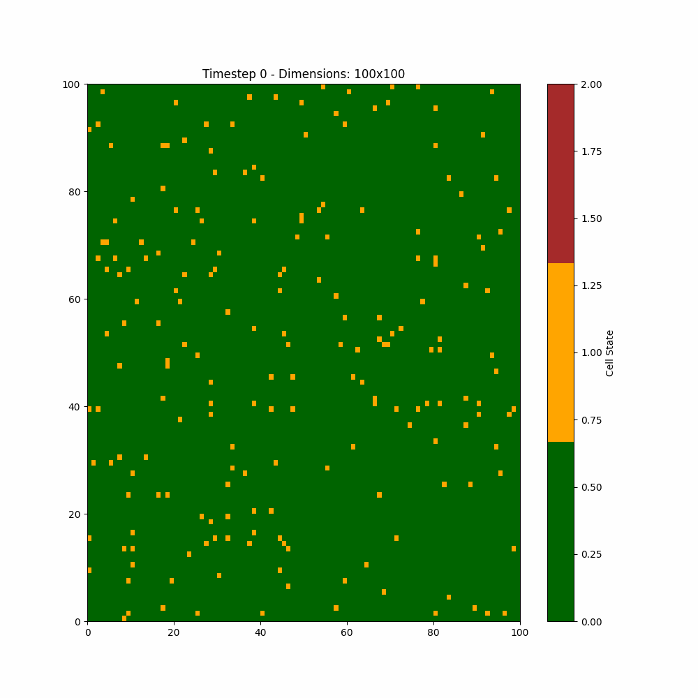
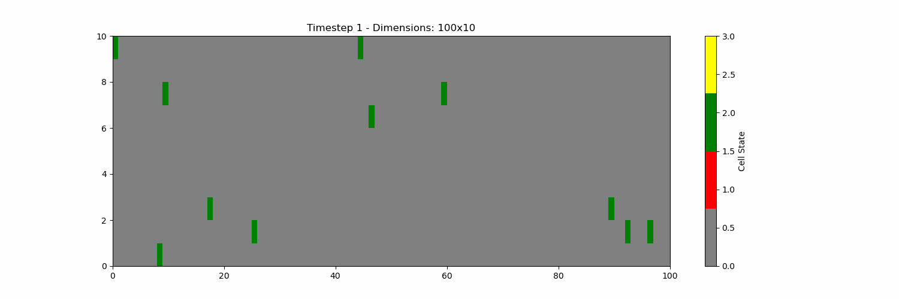
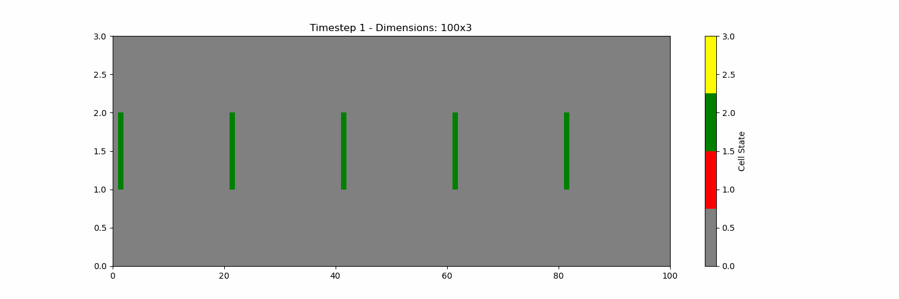

# 274b-final
Cellular Automata Software Library

# Library Overview

The CA library is built on two main classes: `Cell` and `CA`. 

The `Cell` class captures the state and logic contained within a cell of the cellular automata grid. A base `Cell` class is provided with the two key components, a `current_state` and `next_state` and update logic. From this, the user can inherit from this base class and extend additional cell functionality. 

The `CA` class handles all the operations of the cellular automata grid. It stores an array of `Cell`s, provides functionality to index, update, print, and find cells within the grid. 

Most importantly, the `CA` class has a `run` method which takes in a function that is used to update the cells in the grid based on specified rules. We have a pre-defined set of rules that can be used, individually or in successsion with eachother, or the user can provide their own custom update logic. 

## Quickstart

Here we use a simple forest fire example to demonstrate the functionalities and use of the library. Later, we will extend this to a more sophisticated traffic example that we believe truly showcases the power of our library.

In this example we will have a grid of trees, each tree can either be 'normal' (0), 'on fire' (1), or 'charred' (2). A normal tree will stay normal until one of its neighbors is on fire, then it too will catch on fire. If a tree is on fire, then in the next state it will become charred.

First, let's create a `CA` with a grid of 100 rows x 100 columns. `CA(int rows, int cols, Boundary boundary)`. Here, since we only need a single state, we can use the base `Cell` class. We have a choice of what boundary to use. For our forest, we will make it walled, which just means the grid 'ends' at the edges:

``` c++
#include "CellularAutomata.h"

CA<Cell<int>> forest(100, 100, walled);

```

Now we need to specify what the initial state of the trees. There's a few ways we can set these states:

We can manually specify a particular cell at `row`, `col` and explicitly set its next state (then call update to push the change to the current_state).

``` c++
forest.getCell(20, 20)->setNextState(1)
forest.getCell(1, 15)->setNextState(1)
forest.updateAll();
```

Or, we can specify a state to randomly populate based on some probability with the `void CA::randomInit(T state, double prob)` method. You can either specify a state directly, or if you have created your own cell type, you can specify a `setVoidState` and `setDefaultState`, which can perform more complex actions to set up a cell's state. Here, we specify a 20% chance of making each cell on fire.

``` c++
forest.randomInit(1, 0.2);
```

Now, we may want to see the state of the automata at the start. There are a few options. First, you can do a simple print to the console with the `void CA::print()` method.

``` c++
forest.print()
```

> 1    0    0    0    0    0    1    0    1    1    0    0    0    0    0    0    1    0    0    0\
> 0    0    1    0    0    0    0    1    0    1    0    0    0    1    1    0    0    0    1    0\
> 1    0    0    0    0    0    0    0    0    0    0    1    0    1    0    0    0    0    0    1\
> 0    0    0    0    0    0    0    0    1    0    0    1    0    0    0    0    1    0    0    0\
> 0    0    0    1    0    0    1    0    1    0    0    0    0    0    0    0    0    0    0    0\
> 0    0    0    0    0    0    0    0    0    1    0    1    0    0    0    0    1    0    0    0\
> 0    0    0    1    0    1    0    0    0    0    0    1    0    0    0    0    0    0    0    0\
> 1    0    0    0    1    1    0    1    0    0    0    0    0    0    1    0    0    0    1    0\
> 0    0    0    0    0    0    0    0    1    0    0    0    0    0    0    0    0    1    0    0\
> 1    0    0    0    0    0    1    0    0    0    0    0    1    1    0    0    1    0    0    0\
> 0    0    0    0    0    1    0    1    1    0    0    0    1    0    0    0    0    1    1    0\
> 0    0    1    1    0    1    0    0    0    0    0    0    0    0    0    0    1    0    0    0\
> 0    1    0    0    0    0    0    1    0    0    0    0    1    1    0    0    0    1    0    1\
> 0    1    0    0    0    1    0    0    1    1    1    0    0    0    0    0    0    0    0    0\
> 0    0    0    0    0    0    0    0    0    1    0    1    1    0    0    0    0    0    0    0\
> 1    0    0    0    1    0    0    0    0    0    0    1    1    0    0    0    0    0    0    1\
> 0    0    0    0    0    1    0    1    1    0    0    0    1    0    1    0    0    1    0    1\
> 0    0    0    0    0    1    0    0    0    0    0    0    0    0    1    0    1    1    0    0\
> 0    0    0    0    0    0    0    0    0    0    0    0    0    0    0    0    0    0    1    0\
> 1    1    0    0    0    0    0    0    0    0    1    1    0    0    0    1    0    0    1    1

Or, we can set up more sophisticated io by providing a file path to write to with `void CA::enableCSV(std::string)`. This will write each iteration of the CA to the specified file:

``` c++
forest.enableCSV("test_forest_fire.csv"); 
```

This can be turned off with: 
``` c++
forest.disableCSV();
```

Now to add our rules! Our library uses a passed in update function to allow the user to specify their rules for the model update. We provide a number of common rules that can be put together to form complex models. Each of the pre-defined rules modify a cells `next_state` attribute, only once all rules have been applied do the updates actually apply and mutate the `current_state`. Therefore, you can specify multiple rules back to back and the `CA` will only update after all rules are applied. If you did want to update in-between rules, the user does have the option to manually call `void CA::updateAll()`.

Let's set up our rules for the forest fire. First, we can to specify that any tree that is on fire (1) at time T will be charred (2) at time T+1. We also want to specify that any normal tree whose Moore neighbor is on fire at time T should also be on fire at time T+1. But, we don't want charred trees to turn back on fire. 

``` c++
#include "Rules.h"

void forestFireUpdate(CA<Cell<int>>& forest) {

    // Set on-fire trees to be charred
    conditionalTransitionRule(forest, 1, 2);

    // Now, spread the fire based on Moore neighborhood
    // specify to exclude state 2
    conditionalRuleMoore(forest, 1, 1, {2});
}
```

First, we apply the `void conditionalTransitionRule(CA<Cell<T>>& ca, T start_state, T end_state)` transforms any trees that are on fire to charred. We could alternatively give a map of states as shown below:

``` c++
// Could alternatively set a mapping if there are multiple states to update

std::unordered_map<int, int> state_map;

state_map[0] = 0; // normal trees stay normal
state_map[1] = 2; // on fire trees turn charred
state_map[2] = 2; // charred trees stay charred

conditionalTransitionRule(forest, sate_map);

```

Then, we use the `void conditionalRuleMoore(CA<Cell<T>>& ca, T trigger_state, T end_state, std::vector<T> exclude)` function to specify that any cell whose neighborhood contains a cell with the `trigger_state` (fire), should be set to `end_state` (fire). But, we also don't want any already charred trees to be put back on fire! To prevent this we pass the charred state to the `exclude` argument so that any cell matching a state in the exclude list will not be affected.

Now that we have set up our CA and our update logic, its time to run the model! We use the `CA::run(int iterations, std::function<void(CA<CellType>& ca))>)` method for running:

```
forest.run(10, forestFireUpdate);
```
This will run 10 iterations, saving the state of each iteration to file. But, you can also add additional information printed between each iteration as well!

For example, you can query how many cells have a particular state and report out. Here, run one iteration at a time, and use the `int CA::getStateCount(T state)` method to show how many trees are in each state:

``` c++
  for (int i = 0; i < 10; i++) {
    forest.run(1, forestFireUpdate);
    std::cout << "Time step #" << i + 1 << ": " << std::endl;
    std::cout << "# of trees not on fire: " << forest.getStateCount(0)
              << std::endl;
    std::cout << "# of trees on fire: " << forest.getStateCount(1) << std::endl;
    std::cout << "# of charred trees: " << forest.getStateCount(2) << std::endl
              << std::endl;
  }
```

> Time step #0:\
> \# of trees not on fire: 394\
> \# of trees on fire: 6\
> \# of charred trees: 0\
>\
> Time step #1:\
> \# of trees not on fire: 353\
> \# of trees on fire: 41\
> \# of charred trees: 6\
> \
> Time step #2:\
> \# of trees not on fire: 281\
> \# of trees on fire: 72\
> \# of charred trees: 47\
>\
> Time step #3:\
> \# of trees not on fire: 203\
> \# of trees on fire: 78\
> \# of charred trees: 119\
> \
> Time step #4:\
> \# of trees not on fire: 136\
> \# of trees on fire: 67\
> \# of charred trees: 197\
>\
> Time step #5:\
> \# of trees not on fire: 79\
> \# of trees on fire: 57\
> \# of charred trees: 264\
> \
> Time step #6:\
> \# of trees not on fire: 48\
> \# of trees on fire: 31\
> \# of charred trees: 321\
> \
> Time step #7:\
> \# of trees not on fire: 26\
> \# of trees on fire: 22\
> \# of charred trees: 352\
>\
> Time step #8:\
> \# of trees not on fire: 10\
> \# of trees on fire: 16\
> \# of charred trees: 374\
> \
> Time step #9:\
> \# of trees not on fire: 0\
> \# of trees on fire: 10\
> \# of charred trees: 390\
> \
> Time step #10:\
> \# of trees not on fire: 0\
> \# of trees on fire: 0\
> \# of charred trees: 400

The program in its entirety is as follows:

``` c++
#include "CellularAutomata.h"
#include "Rules.h"

void forestFireUpdate(CA<Cell<int>>& forest) {
  // Set on-fire trees to be charred
  conditionalTransitionRule(forest, 1, 2);

  // Spread the fire based on Moore neighborhood
  // specify to exclude state 2
  conditionalTransitionRuleMoore(forest, 1, 1, {1, 2});
}

void reportStateCounts(CA<Cell<int>>& ca, int iteration) {
  std::cout << "Time step #" << iteration << ": " << std::endl;
  std::cout << "# of trees not on fire: " << ca.getStateCount(0) << std::endl;
  std::cout << "# of trees on fire: " << ca.getStateCount(1) << std::endl;
  std::cout << "# of charred trees: " << ca.getStateCount(2) << std::endl
            << std::endl;
}

int main() {
  // Initialize our forest model
  CA<Cell<int>> forest(100, 100, walled);
  forest.randomInit(1, 0.01);

  // Enable full grid-state report to file
  forest.enableCSV("test_forest_fire.csv");

  // Report initial state
  reportStateCounts(forest, 0);

  // Run iterations
  for (int i = 1; i < 11; i++) {
    forest.run(1, forestFireUpdate);
    reportStateCounts(forest, i);
  }

  return 0;
}

```

Now, to compile the program we must specify the proper include directories for the `CellularAutomata.h`, `Cell.h`, and the libmyrandom library. If this program is located at `examples/tests/test_forest_fire.cpp`, then we would compile with the following:

`g++ -std=c++11 -O3 test_forest_fire.cpp -e ../bin/test_forest_fire -I../../include -I../include -L../../lib -lmyrandom`

Running the program with yields the `test_forest_fire.csv`. Now, we can visualize the results!

The visualization utility was implemented in Python and makes use of the matplotlib and imageio libraries to create informative visual representations of the CA simulation. It works by creating a plot of the grid for each time step and saving the images to a specified directory. The optional `--gif` argument allows users to seamlessly generate animated GIFs of the plots. The Python script can be run from the command line like so:
```bash
python ca_plot.py test_forest_fire.csv forest --colors "{0:'darkgreen', 1:'orange',2:'brown'}" --gif True
```



## Our Traffic application and custom update functions

We developed a traffic simulation application by building a complex set of update rules. Each cell in the cellular automata is either an emtpy section of road, or occupied by a car. The cars can either be moving, or occasionally will get a flat tire that stops it for 10 iterations, causing a slowdown. 

In each time step, each car moves forward based on its current velocity. But, if there is a car in front of it, it either must slow down to match that cars speed, or if the car has a flat tire, switch lanes to go around it. The end product is shown below!



### How the traffic simulation works

The code for this simulation can be found in the `examples` directory. First, there is a custom `CarCell` (`examples/include/CarCell.h`) class that inherits from the basic `Cell` class and defines the logic for a car's state. This class manages making flat tires, storing the velocity, and whether the cell is actually a car, or just empty road. 

Then, we defined custom update logic in `examples/include/Traffic.h`. We define three functions with increasing complexity:
  1. `trafficUpdate`: simple update function where cars only have a single speed and cannot switch lanes
  2. `trafficUpdateChangeLanes`: slightly modified so that cars can switch lanes to get around a stopped car in front
  3. `trafficUpdateChangeLanesPlusSpeed`: the most complex function where the longer cars drive uninterrupted, their speed increases until hitting a max speed.

These functions make use of our library's provided `CA` attributes to get, set, and manipulate the cells. Namely, it uses the 

``` c++
std::shared_ptr<CellType> CA::getRelativeCell(const int row,
                                            const int col,
                                            const int Drow,
                                            const int Dcol)
```

function to get the cell relative to another cell. This is used to check if the road in front is empty, for example. We also use two generic functions that are provided for the base cell, but are overridden to have specific logic for the `CarCell`: `setDefaultState` and `setVoidState`. These functions can be used to wrap setting multiple attributes of the cell at once. Here, setting to the 'void' state turns the cell into an empty stretch of road, and to 'default' gives a car with velocity of 1. 

The functionalities provided by our library made implementing the traffic rules very easy! The hardest part was coming up with cohesive rules that covered the scenarios we wanted, from there the updating of states and ability to get relative cells made the code easy to write.


### Runnng a simulation

We provide a command line interface for running a traffic simulation in `examples/application/traffic_simulation.cpp`, which can be compiled with the `examples/application/Makefile` to produce the binary at `examples/bin/traffic_simulation`. Running the program allows the user to specify the grid size, probability of a car at each cell, output file, and number of iterations:

```console
(msse) [cjpeh bin]$ ./traffic_simulation
Number of rows:10
Number of columns:100
Probability of cell being a car:0.01
Output file:traffic_simulation.csv
Iterations to run:100
```
Then, we can create a nice traffic image with `python ../../src/Visualization/ca_plot.py traffic_simulation.csv traffic_simulation_plots --gif True --height 5 --width 15 --colors "{0:'grey',1:'red',2:'green',3:'yellow'}"`!
We also provide a Makefile target in the `examples/bin/Makefile` called `traffic_simulation_plots` that will create the gif as well.

### Experimenting with different frequency of flat tires

From the above simulation, we can see that as flat tires occur, it slows down cars and causes them to bunch up, causing their speeds to drop. To further investigate this, we ran the simulation with increasing probability of flat tires with an initial state that has the cars purposefully spaced out:


1/1,000,000 odds:


1/1,000 odds:


1/100 odds:


1/50 odds:


1/10 odds:


To quantify this affect, we measured the average speed of *moving* cars for each of these simulations. We exclude the speed of cars with flat tires since we are trying to quantify the affect of the flat tires on the other cars!

We see that as the number of stops and lane changes (which cause the car's speed to reset to 1) increases, the average speed of the moving cars decreases!

| Odds of a flat | Average speed of moving cars |
| -------------- | ---------------------------- |
| 1 / 1,000,000 | 9.55 |
| 1 / 1,000 | 9.55 | 
| 1 / 100 | 8.9 | 
| 1 / 50 | 7.7 |
| 1/ 10 | 4.9 |

Obviously increasing the odds of a flat tire makes the cars move through the simulation slower. But, it is dramatic how much the affect is on other cars around it in addition to just the cars that themselves have flat tires. In the 1/10 odds case we even see a point where one car gets stuck behind a car with a flat tire but can't change lanes to get around the blockage because there is another flat tire below it!


We include this code at `examples/application/compare_flat_rates.cpp` with the corresponding Makefile target `compare_flat_rates`, and a plotting utility once the program is compiled at `examples/bin/Makefile`s target `compare_flat_rates_plot`.


